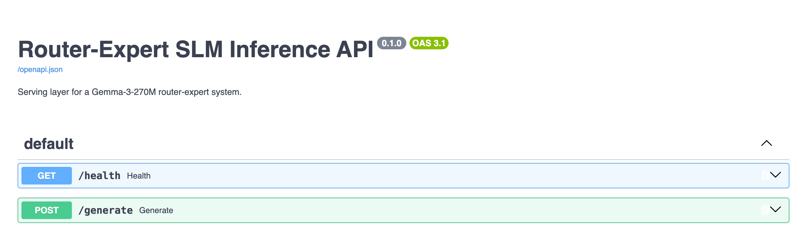

# Router-Expert SLM

A router-expert system on **Gemma-3-270M**: a learned 3-way router sends each query to one
of three task-specialized fine-tuned experts (factual QA, reasoning, instruction
following), served behind a production FastAPI API.

## Results

Zero-shot, 1,000 examples/task, averaged over 5 seeds. **Router-Expert beats both baselines
on every benchmark.**

| Benchmark | Pretrained | Instruction-tuned | **Router-Expert (ours)** |
|-----------|:---:|:---:|:---:|
| TriviaQA (EM)        | 0.1229 | 0.1004 | **0.1556** |
| ARC-C (accuracy)     | 0.2365 | 0.2596 | **0.3304** |
| IFEval (loose acc.)  | 0.2722 | 0.3726 | **0.4779** |

<sub>Baselines: `google/gemma-3-270m` and `google/gemma-3-270m-it`. Source: project report, Table 2.</sub>

## Deployable

FastAPI service with typed I/O, structured logging, health checks, and Docker packaging.



## Quickstart

```bash
pip install -r requirements.txt
uvicorn app.main:app --port 8000          # first start pulls ~2 GB of weights from the HF Hub

curl -s http://localhost:8000/generate -H 'content-type: application/json' \
  -d '{"query": "What is the capital of France?"}'
# → {"answer": "...", "route": "factual_qa", "router_confidence": 1.0, "latency_ms": 161.7, ...}
```

Or `docker compose up --build`. Measured latency on an Apple M4: **p50 318 ms**, p95 3.3 s,
~1.5 req/s sequential ([details](docs/serving.md#benchmark)).

## How it works

A lightweight Gemma-3-270M **classifier** routes each query to `{factual_qa, reasoning,
instruction_following}` and exposes its confidence. Each route has its own SFT expert; the
reasoning expert adds chain-of-thought **self-consistency** (K=5 majority vote). Flow:
`query → router → expert → answer`. Full diagram in
[docs/architecture.md](docs/architecture.md).

## Documentation

| Doc | Contents |
|-----|----------|
| [Architecture](docs/architecture.md) | Routing, the three experts, inference path |
| [Data pipeline](docs/data.md) | Six datasets, ~168K examples, normalization (CommonsenseQA 5→4, chat flattening, constraint filtering) |
| [Training](docs/training.md) | Prompt-masked SFT, per-task sequence lengths, hyperparameters, checkpoint selection |
| [Evaluation](docs/evaluation.md) | Metrics, methodology, reproduction commands |
| [Serving](docs/serving.md) | Endpoints, request/response, env config, Docker, full benchmark |
| [Ablations](docs/ablations.md) | Negative results — BM25 RAG **did not help** and is disabled; temperature and few-shot findings |

## Repository structure

```
src/
  data/        dataset download + SFT/router data prep
  train/       SFT for experts and the router
  inference/   router-expert pipeline + generation helpers
  eval/        evaluation, scoring, and ablations/
app/           FastAPI serving layer
benchmarks/    latency/throughput harness
scripts/       thin CLI entrypoints (python scripts/<name>.py)
docs/          deep-dive documentation
ifeval/        vendored IFEval evaluator
```

Model weights, datasets, and run outputs are git-ignored and pulled/generated on demand.

## Attribution

Duke COMPSCI 590 group project. This repo packages the work I (**Oliver You**) led — the SFT
data pipeline, the task-specific training corpora, the expert SFT scripts, and the design
and training of the 3-way router — plus a FastAPI serving layer, Docker packaging, and a
benchmark added afterward to demonstrate a production inference path. The BM25/embedding RAG
pipeline, inference-strategy and ablation studies, and report analysis were contributed by
teammates (Leonardo Biral, Ziqi Zhou, Jiajun Cheng).
